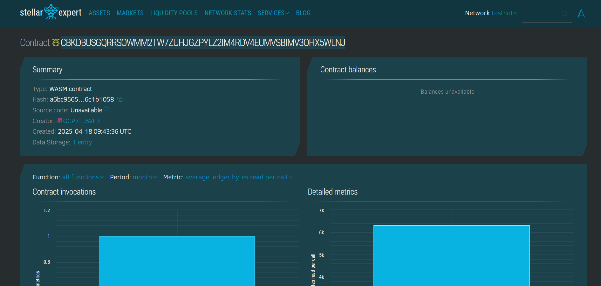

# NFT Merge Contract

## Project Title
NFT Merge Contract

## Project Description
The NFT Merge Contract is a smart contract developed for the Soroban blockchain that enables users to merge two or more NFTs into a single, unique NFT. This decentralized mechanism allows for secure and efficient management of digital collectibles by combining NFTs and generating a new token with a distinct identifier. The contract ensures full transparency and traceability of each merge, offering collectors a new layer of creativity and control over their digital assets.

## Project Vision
The vision of the NFT Merge Contract is to empower digital collectors by providing tools to reshape and reimagine their collections. We aim to make NFT merging a standard mechanism for enhancing utility, fostering creativity, and enabling next-generation asset management in the decentralized world.
This project aspires to become a cornerstone in NFT innovation, driving new forms of expression and utility across decentralized ecosystems.

## Key Features
- NFT Merging: Combine two or more NFTs to create a new NFT with a unique ID.
- Merge History Tracking: Maintain a full history of merged NFTs, including their original components.
- Ownership Management: Automatically updates and enforces correct ownership throughout the merging process.
-Fully Decentralized: Operates without central authority, ensuring transparency and trust.

## Future Scope
- Custom Merge Rules: Introduce merging logic based on NFT attributes, rarity, or user-defined parameters.
- Expanded Functionality: Support for burning, staking, and reward mechanics tied to merged NFTs.
- Cross-Chain Compatibility: Enable merging of NFTs from different blockchains through interoperability features.
- User-Friendly Interface: Develop a front-end application for intuitive user interactions without requiring blockchain technical knowledge

## Contract Details
CBKDBUSGQRRSOWMM2TW7ZUHJGZPYLZ2IM4RDV4EUMVSBIMV3OHX5WLNJ

